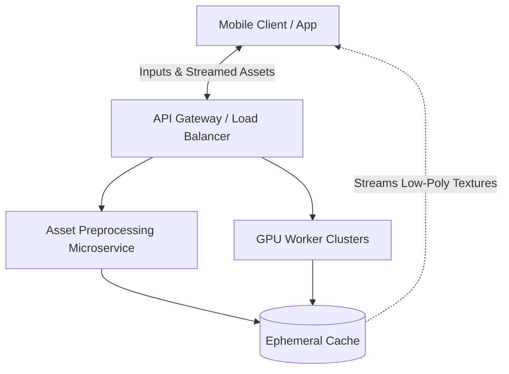

# System Architecture: Myntra Digital Fitting Room

## 1. High-Level Architecture

To mitigate significant client-side bottlenecks (thermal throttling, OOM crashes, low framerates), the system strictly enforces a **Client-Server Split**. Heavy computer vision and 3D simulation workloads are offloaded to scalable, server-side GPU worker clusters. The client device is solely responsible for rendering optimized, lightweight, low-polygon texture assets streamed from the backend.

## 2. Core Components

### A. Mobile Client (Frontend)
- **UI/UX Layer:** Integrates directly into the Myntra wishlist page.
- **Rendering Engine:** Built to handle optimized low-polygon meshes and 2D-to-3D mapped textures efficiently on mid-range Android devices.
- **Memory Manager:** Enforces strict memory policies to prevent memory exhaustion and OOM crashes. Implements ephemeral compressed texture caches, aggressive garbage collection, and a 3-second timeout fallback (falling back to a vector loading state).

### B. Asset Preprocessing Microservice
Designed to handle unstandardized seller inputs (images lacking alpha masks, varied lighting/backgrounds, missing depth maps).
- **Background Removal:** Automated computer vision pipeline to isolate garments.
- **Standardization:** Normalizes image dimensions and standardizes color profiles.
- **Caching:** Prepares assets and pushes them to the user-facing cache to prevent asynchronous ingestion latency during live user interactions.

### C. Backend GPU Worker Clusters
Scalable instances responsible for the heavy computational lifting. It drives the **Dual-Mode Engine Pipeline**:

#### Mode A: Body Double / AI Avatar
- **Input:** Numerical parameters (Weight, Height, Body Shape).
- **Processing:** Parametric 3D avatar generation. Pre-rigged base meshes are dynamically scaled according to the input arrays.
- **Output:** A customized 3D mesh mapped with the selected garment's texture.

#### Mode B: Photo-Realistic AR
- **Input:** Single full-body user photo.
- **Processing:** 
  1. Body segmentation and depth estimation.
  2. Single-image silhouette warping.
  3. 2D-to-3D texture coordinate mapping to accurately simulate cloth draping.
- **Output:** A warped silhouette with accurately draped clothing.

## 3. Data Flow & Pipelines

### Mode A (Avatar) Pipeline
1. User inputs height/weight/body parameters in the Client.
2. Request is routed via API Gateway to the GPU Cluster.
3. GPU Cluster retrieves pre-processed garment asset, scales the base mesh, and maps the garment texture.
4. Optimized 3D model is streamed back to the Client and cached ephemerally.

### Mode B (AR) Pipeline
1. User uploads a full-body photo.
2. Photo is sent to an **isolated, ephemeral container session** on the backend.
3. GPU cluster segments the user's body, warps the garment silhouette, and applies 2D-to-3D texture mapping.
4. Final composed lightweight rendering asset is streamed to the Client.
5. **Security Trigger:** Session token expires; raw image data is instantly purged from memory.

## 4. Infrastructure & Security Measures
- **Data Privacy:** To eliminate regulatory exposure and privacy vulnerabilities, all user-uploaded photos and body dimension profiles are processed entirely in stateless, ephemeral containers.
- **Zero Retention Policy:** Raw image data and sensitive dimension profiles are never stored in persistent cloud databases. Data is purged from memory instantaneously once the rendering session token expires.
- **Scalability & Latency:** GPU workers autoscale based on wishlist traffic, guaranteeing low latency and ensuring client-side framerates remain stable (preventing drops < 15 FPS).
